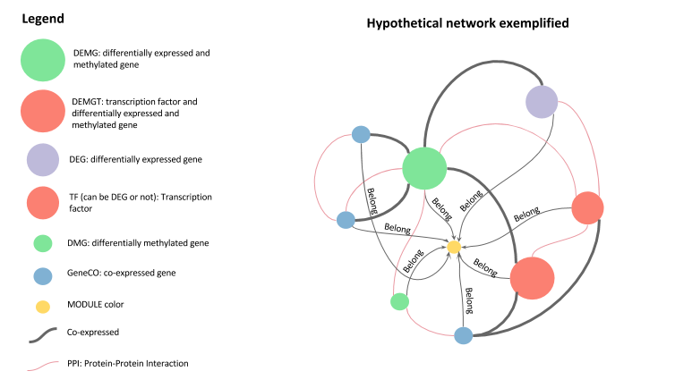

# Head-neck-squamous-cell-carcinome co-expression network of HPV+ samples

### Introduction

Head-and-neck squamous cell carcinoma (HNSCC) is a heterogeneous malignancy which accounts for approximately 300,000 deaths each year worldwide. Smoking, alcohol, and infections by high-risk human papillomavirus (HPV) are among the main risk factors for the development of the disease. The incidence of HPV-associated HNSCC is around 25% of the reported cases worldwide, with an even higher proportion in oropharyngeal cancer, and a predominance of infection by HPV-16 and HPV-18 types among those cases. 

The TCGA (The Cancer Genome Atlas) is paramount for data collection of more than 30 cancer types. The diversity of omic layers, such as RNA-seq, methylation, miRNA, proteomic, clinical, copy number variation and mutation, can be analyzed in different aspects including mathematical models, machine learning, and data model. 

The manuscript was submitted to `GigaScience`. The preprint version can be read on [PeerJ preprint](). The graph data model (`Neo4j` database) was chosen to be easier to explore the connectivity among genes in the co-expressed network. This model consists mainly of nodes, edges, and properties.  

### Network data model 

.

### Neo4j

Neo4j is a highly scalable, robust (fully ACID) native graph database. Neo4j is used in mission-critical apps by thousands of leading, startups, enterprises, and governments around the world.

### How to use

#### Install `Neo4j` (version 2.3.4) locally.

Visit the site: (https://neo4j.com/release-notes/neo4j-2-3-4/) and get the instruction how to download and unzip Neo4j.

#### Put the database

The database directory `hdscc.db` can be moved to `neo4j-community-xxx/data/`.

#### Change the configuration

You need change the configuration. 

* Open the archive `/conf/neo4j-server.properties`.
* Change the line: `org.neo4j.server.database.location=data/graph.db` to `org.neo4j.server.database.location=data/hpv.db`.
* Save and close the archive.

#### Start and use the database

* Start Neo4j in: `./bin/neo4j start`. 
* Open the browser and write the locahost in 7474 port: (http://localhost:7474).

### Simple queries

There are many possibilities of queries in a graph database using [Cypher](https://neo4j.com/developer/cypher-query-language/), a declarative SQL-inspired language. Here are two Cypher queries examples.

Show all co-expressed genes with PPI interactions too:

    MATCH (g:GENE)-[r:PPI_interaction]-(h:GENE)-[r2:Co_expression]-(g) 
    RETURN count(g)
    
Find the gene connections among two modues via PPI:

    MATCH (m:MODULE)-[r0:Belong]-(g:GENE)-[r:PPI_interaction]-(h:GENE)-[r2:Belong]-(mo:MODULE) 
    WHERE m.name="YellowHPV+" AND mo.name= "BlueHPV+" 
    RETURN DISTINCT g, m, h, mo

### Contact
If you have any consideration for this work which can improve the quality, please let us know! Thanks ;-)

**e-mail**: quelopes@gmail.com. 
<!-- Ask questions and please report any bug you find. -->
<!-- MATCH (m:MODULE)-[r0:Belong]-(g:GENE)-[r:PPI_interaction]-(h:GENE)-[r2:Co_expression]-(g) WHERE m.name="BlueHPV+" return g -->
<!-- MATCH (m:MODULE)-[r0:Belong]-(g:GENE)-[r:PPI_interaction]-(h:GENE)-[r2:Co_expression]-(g) WHERE m.name="YellowHPV+" return g -->
